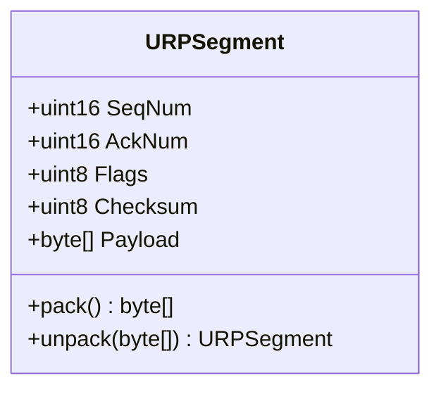

# Chapter 1: Core Data Structures

Welcome to the workshop! Every great project starts with a solid foundation. For our Reliable UDP protocol, that foundation is the data structure that will carry our messages. This chapter will guide you from the basic problems of unreliable networks to creating the core data modules for our project.

---

### 1. Remember & Understand (The "Why")

**The Problem:** Imagine you're sending a novel to a friend using postcards. If you just write the story and send them, you'll face chaos:
-   **Out-of-Order:** Postcards arrive in the wrong sequence.
-   **Corrupted:** The ink gets smudged and becomes unreadable.

UDP is just like this. It sends data but offers no guarantees about order or integrity.

**The Theory:** To solve this, we need to create a standardized format for our data, a **Segment**. This is a digital envelope with two parts: a **Header** (instructions for the receiver) and a **Payload** (the actual data).

To fix the problems, our header needs two key fields:
-   A **Sequence Number (`SeqNum`)** to solve the ordering problem.
-   A **Checksum** to detect if the data has been corrupted.

---

### 2. Apply (The "How")

**Design Sketch (Workshop on Paper):**

Let's think about how to represent this in code. A `Segment` can be visualized as a class or struct with specific fields and methods.



Here is some pseudocode to guide your thinking:

**Checksum Logic:**
```pseudocode
function compute_checksum(data_bytes):
  sum = 0
  for each byte in data_bytes:
    sum = sum + byte
  
  // Return the lower 8 bits of the sum
  return sum MOD 256

function validate_checksum(segment_bytes):
  // Temporarily store the checksum from the packet
  received_checksum = segment_bytes[5]
  
  // Zero out the checksum field to calculate
  segment_bytes[5] = 0
  
  // Calculate the checksum on the rest of the packet
  calculated_checksum = compute_checksum(segment_bytes)
  
  // The packet is valid if they match
  return received_checksum == calculated_checksum
```

**Segment Packing & Unpacking:**
```pseudocode
function pack(segment_object):
  // Create a byte array for the header (6 bytes)
  header_bytes = new byte[6]
  
  // Convert 16-bit numbers to 2 bytes (Big Endian)
  write_uint16_big_endian(header_bytes, 0, segment_object.SeqNum)
  write_uint16_big_endian(header_bytes, 2, segment_object.AckNum)
  header_bytes[4] = segment_object.Flags
  
  // Checksum is calculated on the header (without checksum field) + payload
  temp_data = header_bytes[0:4] + segment_object.Payload
  checksum = compute_checksum(temp_data)
  header_bytes[5] = checksum
  
  // Combine header and payload
  return header_bytes + segment_object.Payload

function unpack(raw_bytes):
  if length(raw_bytes) < 6:
    return error "Packet too small"
  
  // Create a new segment object
  segment_object = new URPSegment()
  
  // Read the fields from the byte array
  segment_object.SeqNum = read_uint16_big_endian(raw_bytes, 0)
  segment_object.AckNum = read_uint16_big_endian(raw_bytes, 2)
  segment_object.Flags = raw_bytes[4]
  segment_object.Checksum = raw_bytes[5]
  segment_object.Payload = raw_bytes[6:end]
  
  return segment_object
```

---

### 3. Analyze (The "Trade-offs")

**Puzzle / Critical Thinking:**

Our checksum algorithm will be a simple 8-bit sum of all the bytes in the packet (modulo 256). This is fast, but is it perfectly reliable?

Consider two different payloads: `[0x01, 0x02]` and `[0x02, 0x01]`.
1.  What is the 8-bit sum checksum for both?
2.  Now consider the payload `[0x01, 0x02, 0xFF]`. What is its checksum? What about `[0x01, 0x03, 0xFE]`?
3.  What does this tell you about the limitations of this simple checksum? What kind of data corruption might it *fail* to detect?

This is a classic trade-off between performance and robustness.

---

### 4. Evaluate (The "Justification")

**Design Rationale:**

The reference implementation uses an 8-bit checksum for simplicity and educational clarity. As you discovered in the puzzle, this method is not perfect. It can fail to detect errors where byte order is swapped or where multiple errors cancel each other out.

Professional protocols like TCP and UDP use a more robust algorithm called a **16-bit one's complement sum**. It's more computationally intensive but catches a much wider range of errors, including swapped bytes.

For this project, our simple checksum is sufficient to learn the *principle* of error detection. We are evaluating that educational clarity is more important here than cryptographic-level error detection.

---

### 5. Create (Your Implementation)

**Coding Workshop:**

It's time to write the code. Based on your design sketch, create the two core modules for your project.

1.  **Create your `Segment` module.** This class or struct should contain the header fields and payload. Implement `pack()` and `unpack()` methods.
    *   **Important:** When packing and unpacking multi-byte fields (like the 16-bit `SeqNum`), you must handle the **network byte order**, which is **big-endian**. Most languages provide library functions to ensure this conversion is done correctly.
2.  **Create your `ErrorDetection` module.** This should contain your `compute_checksum()` and `validate_checksum()` helper functions.

You have now built the foundational data structures for the entire protocol! For a complete reference, you can examine the Go implementation in the `internal/urp/` directory of this repository.

**[Next Chapter: Connection Management](./../02-connection-management/README.md)**
