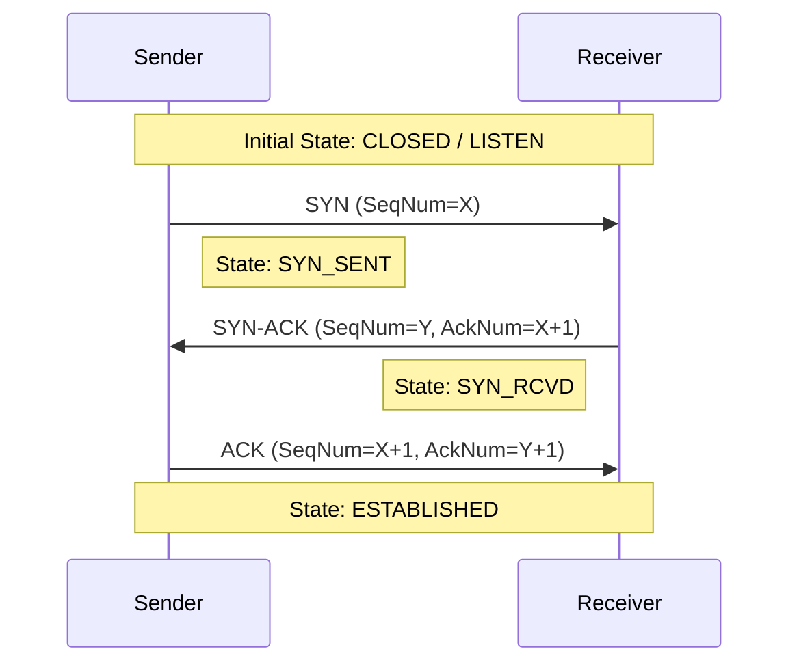

# Chapter 2: Connection Management

With our core data structures in place, we can now address a fundamental question: how does a connection start and end? We can't just start sending data into the void. We need a polite "handshake" to begin the conversation and a graceful "goodbye" to end it.

---

### 1. Remember & Understand (The "Why")

**The Problem:**
1.  **Cold Start:** If the Sender just sends a data packet, the Receiver has no idea a new connection is starting. It might be a stray packet from a previous, crashed session. The Receiver needs to be explicitly told, "A new sender wants to talk to you."
2.  **Ambiguous End:** When the Sender is done, how does the Receiver know the file is complete? If the final packet is lost, the Receiver might wait forever for more data.

**The Theory: State Machines & Flags**
To solve this, we introduce the concept of a **connection state**. Both the Sender and Receiver will exist in a specific state (e.g., `LISTEN`, `ESTABLISHED`, `CLOSED`). The connection moves from one state to another based on special messages.

We'll use the `Flags` field in our `URPSegment` header to send these special messages:
-   **`SYN` (Synchronize):** A request to start a new connection.
-   **`FIN` (Finish):** A notification that one side is done sending data.
-   **`ACK` (Acknowledge):** A flag to indicate that the `AckNum` field is valid.

The process of using these flags to establish a connection is called a **three-way handshake**.

---

### 2. Apply (The "How")

**Design Sketch (Workshop on Paper):**

The three-way handshake is a classic sequence of events. A Mermaid diagram is the perfect way to visualize this flow.



Here is the pseudocode for the state machine logic:

**Sender Logic:**
```pseudocode
function establish_connection():
  set_state(SYN_SENT)
  syn_segment = create_segment(flags=SYN, SeqNum=initial_seq_num)
  
  // Retry loop for robustness
  for i from 1 to MAX_RETRIES:
    send(syn_segment)
    
    // Wait for a response with a timeout
    response = receive_with_timeout(RTO)
    
    if response is not null and response.has_flag(SYN, ACK):
      // Handshake successful!
      set_state(ESTABLISHED)
      update_sequence_numbers(response.AckNum)
      return SUCCESS
      
  return FAILURE "Handshake timed out"

function close_connection():
  set_state(FIN_WAIT)
  fin_segment = create_segment(flags=FIN, SeqNum=current_seq_num)
  
  // Retry loop
  for i from 1 to MAX_RETRIES:
    send(fin_segment)
    response = receive_with_timeout(RTO)
    
    if response is not null and response.has_flag(ACK):
      set_state(CLOSED)
      return SUCCESS
      
  return FAILURE "Teardown timed out"
```

**Receiver Logic:**
```pseudocode
function main_receive_loop():
  set_state(LISTEN)
  
  while true:
    segment = receive()
    
    if segment is corrupt:
      continue // Discard
      
    switch get_state():
      case LISTEN:
        if segment.has_flag(SYN):
          set_state(ESTABLISHED) // Simplified state transition
          // Prepare response
          syn_ack_segment = create_segment(flags=SYN,ACK, SeqNum=initial_receiver_seq, AckNum=segment.SeqNum + 1)
          send(syn_ack_segment)
          
      case ESTABLISHED:
        if segment.has_flag(FIN):
          set_state(TIME_WAIT)
          ack_segment = create_segment(flags=ACK, AckNum=segment.SeqNum + 1)
          send(ack_segment)
          
          // Wait for a fixed period before closing to catch stray packets
          sleep(2 * RTO)
          set_state(CLOSED)
          return // End of connection
          
        else:
          // Handle data (covered in next chapter)
          pass
```

---

### 3. Analyze (The "Trade-offs")

**Puzzle / Critical Thinking:**

The three-way handshake is `SYN` -> `SYN-ACK` -> `ACK`. Why is the third message (the final `ACK` from the sender) necessary? Why not just have a two-way handshake (`SYN` -> `SYN-ACK`)?

Consider a scenario where a `SYN` packet from an old connection is delayed in the network and arrives very late. What could go wrong if the Receiver acted on this old `SYN` and the handshake was only two steps? How does the third step prevent this problem?

---

### 4. Evaluate (The "Justification")

**Design Rationale:**

The third step of the handshake is crucial for preventing zombie connections. As you analyzed in the puzzle, a delayed `SYN` from a past connection could trick a server into allocating resources for a connection that the client has long since abandoned.

The third `ACK` serves as a live confirmation from the client: "Yes, I am the one who just sent that `SYN`, and I am ready to proceed." Without it, the server has no way of knowing if the `SYN` it received is fresh or a relic. The three-way handshake ensures that both sides have agreed to start a new connection *in the present moment*.

Similarly, for teardown, a `FIN` handshake ensures both sides know that the data stream is complete and can release their resources gracefully.

---

### 5. Create (Your Implementation)

**Coding Workshop:**

It's time to create the "brain" of your protocol: the `Sender` and `Receiver` logic modules. These will contain the state machines that handle the connection lifecycle.

1.  **Create your `Sender` and `Receiver` modules/classes.** These will hold the state of the connection (e.g., `currentState`, `sequenceNumber`).
2.  **Implement the Handshake Logic:**
    *   In the Sender, create a method to send a `SYN` segment and wait for a `SYN-ACK`. This will transition the sender from a starting state to `ESTABLISHED`.
    *   In the Receiver, the main loop should initially be in a `LISTEN` state. When a `SYN` segment arrives, it should respond with a `SYN-ACK` and transition to `ESTABLISHED`.
3.  **Implement the Teardown Logic:**
    *   In the Sender, create a method to send a `FIN` segment and wait for a final `ACK`.
    *   In the Receiver, when in the `ESTABLISHED` state, it must handle receiving a `FIN` segment by responding with an `ACK` and transitioning to a `TIME_WAIT` state before eventually closing.

You have now built the logic to open and close a connection reliably. The next step is to send data within that connection. For a complete reference, you can examine the Go implementation in the `internal/protocol/` directory.

**[Previous Chapter: Core Data Structures](./../01-core-data-structures/README.md)** | **[Next Chapter: Stop-and-Wait Transfer](./../03-stop-and-wait/README.md)**
