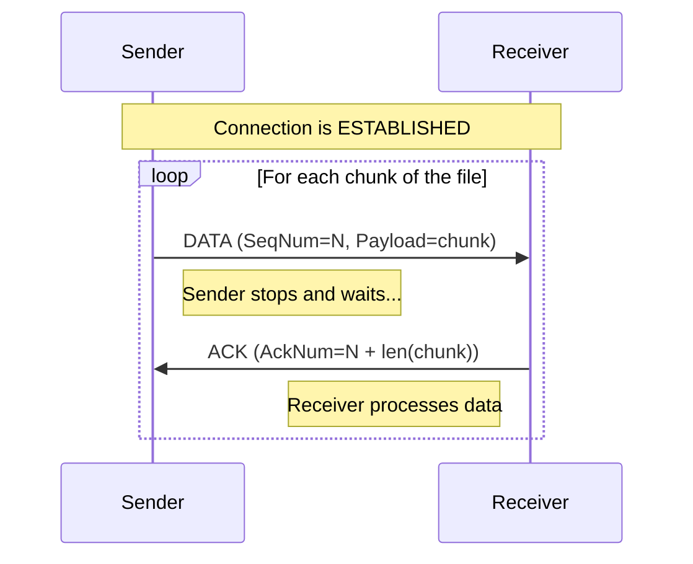

# Chapter 3: Stop-and-Wait Transfer

With a reliable connection handshake, we can now send data. We will start with the simplest possible reliable transfer algorithm: **Stop-and-Wait**. It's not the most efficient, but it's the perfect stepping stone to understanding more complex concepts.

---

### 1. Remember & Understand (The "Why")

**The Problem:**
We have an `ESTABLISHED` connection. The sender needs to send a file, broken into many segments. How does it know that each segment has arrived safely before sending the next one?

**The Theory: Stop-and-Wait**
The algorithm is as simple as its name suggests:
1.  **Sender:** Sends **one** data segment.
2.  **Sender:** **Stops** and **waits**.
3.  **Receiver:** Receives the segment and sends an **Acknowledgment (ACK)**.
4.  **Sender:** Receives the ACK, knows the segment arrived safely, and is now allowed to send the *next* segment.

This process repeats for every single segment. It's like a very cautious conversation where you wait for a "got it" after every sentence.

---

### 2. Apply (The "How")

**Design Sketch (Workshop on Paper):**

The data flow for Stop-and-Wait is a simple, repeating sequence.



Here is the pseudocode for the core logic within the `ESTABLISHED` state:

**Sender Logic:**
```pseudocode
function send_data(file_bytes):
  offset = 0
  current_seq_num = get_initial_seq_num()
  
  while offset < length(file_bytes):
    // Read a chunk of the file up to MSS
    payload = file_bytes[offset : offset + MSS]
    
    // Create and send the segment
    segment = create_segment(flags=DATA, SeqNum=current_seq_num, Payload=payload)
    send(segment)
    
    // Stop and wait for the correct ACK
    // (Robust timeout logic will be added in the next chapter)
    response = receive_with_timeout(RTO)
    
    expected_ack_num = current_seq_num + length(payload)
    
    if response is not null and response.has_flag(ACK) and response.AckNum == expected_ack_num:
      // ACK is correct, advance to the next chunk
      offset = offset + length(payload)
      current_seq_num = expected_ack_num
    else:
      // ACK is incorrect or timeout occurred. We will handle retransmission
      // in the next chapter. For now, this would be an error.
      pass 
```

**Receiver Logic (within the `ESTABLISHED` case):**
```pseudocode
function handle_established_state(segment):
  if segment.has_flag(DATA):
    // Check if this is the packet we are waiting for
    if segment.SeqNum == expected_seq_num:
      // It is! Write data to file.
      write_to_file(segment.Payload)
      
      // Update our expectation for the next packet
      expected_seq_num = expected_seq_num + length(segment.Payload)
      
    // If it's a duplicate (SeqNum < expected_seq_num), we do nothing with the
    // data, but we still send an ACK to help the sender.
    
    // Send a cumulative ACK for the next sequence number we want.
    ack_segment = create_segment(flags=ACK, AckNum=expected_seq_num)
    send(ack_segment)
```

---

### 3. Analyze (The "Trade-offs")

**Puzzle / Critical Thinking:**

Stop-and-Wait is very simple, but it has a major performance problem related to something called **Bandwidth-Delay Product (BDP)**.

Imagine a network connection between Earth and a Mars rover. The time for a radio signal to travel one way (the delay) is about 10 minutes. Let's say our connection has a high bandwidth of 1 Mbps.

1.  Sender sends a 1000-byte packet. This takes about 8 milliseconds to transmit.
2.  The packet travels to Mars (10 minutes).
3.  The rover receives it and sends an ACK.
4.  The ACK travels back to Earth (10 minutes).

How much time did the sender spend **actively sending** versus **waiting**? What percentage of the available 1 Mbps bandwidth is actually being used? This inefficiency is the primary trade-off of Stop-and-Wait.

---

### 4. Evaluate (The "Justification")

**Design Rationale:**

As the puzzle demonstrates, Stop-and-Wait is incredibly inefficient on networks with high latency. The sender spends most of its time idle, waiting for an ACK to travel across the network. The "pipe" of the network is mostly empty.

So why are we implementing it?
1.  **Simplicity:** It's the easiest way to start. The logic for managing the connection is trivial—we only ever need to worry about one packet at a time.
2.  **Foundation:** It forces us to build the core logic of sending data and processing ACKs. The more advanced "Sliding Window" protocol we'll build in Chapter 5 is a direct evolution of Stop-and-Wait, designed specifically to solve this efficiency problem by keeping the pipe full.

We are choosing to build this "inefficient" protocol first because it's the best way to learn the fundamentals before adding complexity.

---

### 5. Create (Your Implementation)

**Coding Workshop:**

It's time to add the Stop-and-Wait logic to the `ESTABLISHED` state in your `Sender` and `Receiver` modules.

1.  **Update your Sender's main data-sending loop.** It should now perform the following steps:
    *   Read one segment's worth of data from the input file.
    *   Create and send the data segment.
    *   **Stop** and **wait** for a corresponding ACK from the receiver.
    *   Only once the correct ACK is received, should the loop continue to the next segment.
2.  **Update your Receiver's `ESTABLISHED` state logic.** When a data segment is received:
    *   Check if its sequence number is the one you are expecting (`expected_seq_num`).
    *   If it is, write the payload to the output file and increment `expected_seq_num`.
    *   Regardless of whether it was the expected segment or a duplicate, send back an ACK segment containing the current `expected_seq_num`.

You have now implemented a basic, but functional, reliable transport protocol! It can transfer an entire file correctly over a perfect network. The next step is to make it robust enough to handle an imperfect one.

**[Previous Chapter: Connection Management](./../02-connection-management/README.md)** | **[Next Chapter: Robust Transfer](./../04-robust-transfer/README.md)**
