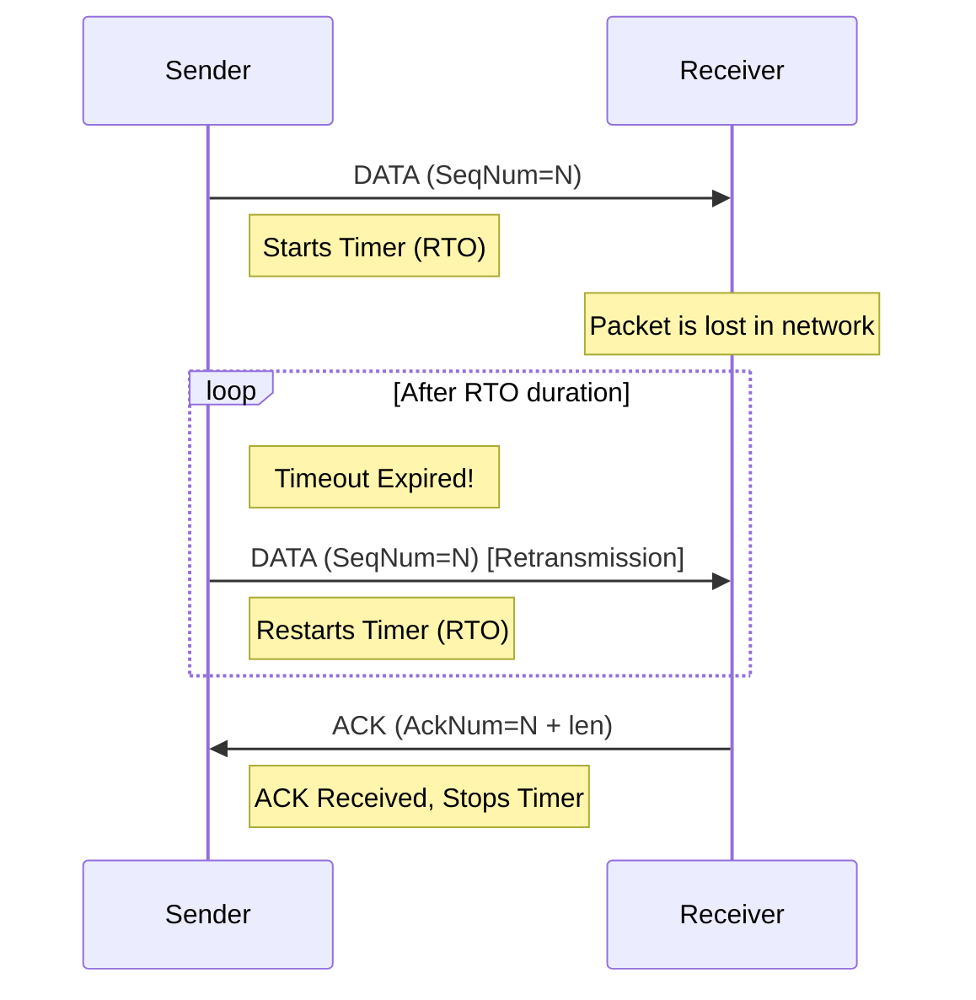

# Chapter 4: Robust Transfer with Timeouts

Our Stop-and-Wait protocol works perfectly, but only on a perfect network. The moment a packet is lost or corrupted, it will fail. In this chapter, we will make our protocol robust by implementing the core mechanisms of reliability: retransmission timeouts and data integrity checks.

---

### 1. Remember & Understand (The "Why")

**The Problem:**
1.  **Packet Loss:** The sender sends a data segment, but it never arrives. The sender will wait forever for an ACK that will never come. The same thing happens if the receiver's ACK is lost on the way back.
2.  **Corruption:** A data segment arrives, but its payload is scrambled. The receiver has no way of knowing this and will write garbage to the output file.

**The Theory:**
1.  **Retransmission Timeout (RTO):** The sender will start a timer every time it sends a data segment. If the timer expires before a valid ACK is received, the sender will assume the packet was lost and **retransmit** the *exact same* segment.
2.  **Checksum Validation:** The receiver will use the `IsValid()` checksum function we built in Chapter 1 on *every single* incoming packet. If the check fails, the packet is corrupt and must be **silently discarded**.
3.  **Duplicate Handling:** Because of retransmissions, the receiver might get the same data packet twice. It must recognize this is a duplicate, discard the data, but still send an ACK to let the sender know it can proceed.

---

### 2. Apply (The "How")

**Design Sketch (Workshop on Paper):**

A sequence diagram helps visualize how a timeout saves the connection when a packet is lost.



Here is the pseudocode for the robust logic:

**Sender Logic (with Timeouts):**
```pseudocode
function send_data_robustly(file_bytes):
  offset = 0
  current_seq_num = get_initial_seq_num()
  
  while offset < length(file_bytes):
    payload = file_bytes[offset : offset + MSS]
    segment = create_segment(flags=DATA, SeqNum=current_seq_num, Payload=payload)
    
    // Retry loop for the current segment
    is_acked = false
    for i from 1 to MAX_RETRIES:
      send(segment)
      start_timer(RTO)
      
      // Wait for an event: either an ACK or a timeout
      event = wait_for_event() 
      
      if event is ACK:
        stop_timer()
        expected_ack_num = current_seq_num + length(payload)
        if event.AckNum == expected_ack_num:
          // Correct ACK received!
          is_acked = true
          break // Exit retry loop
        // else: It's a duplicate/old ACK, ignore and let timer run out or receive correct one
          
      if event is TIMEOUT:
        log("Timeout for segment", current_seq_num)
        // Continue to next retry iteration
        
    if not is_acked:
      return FAILURE "Max retries exceeded for segment"
      
    // Advance to next chunk
    offset = offset + length(payload)
    current_seq_num = expected_ack_num
```

**Receiver Logic (with Validation):**
```pseudocode
function main_receive_loop():
  while true:
    segment = receive()
    
    // 1. Checksum validation is the first gate
    if not validate_checksum(segment):
      log("Corrupt packet received")
      continue // Silently discard
      
    // The rest of the logic from the previous chapter
    if get_state() is ESTABLISHED and segment.has_flag(DATA):
      // 2. Duplicate check
      if segment.SeqNum < expected_seq_num:
        log("Duplicate packet received")
        // Re-send the last ACK to help the sender
        ack_segment = create_segment(flags=ACK, AckNum=expected_seq_num)
        send(ack_segment)
        continue // Discard data and process next packet
        
      // 3. In-order check
      if segment.SeqNum == expected_seq_num:
        write_to_file(segment.Payload)
        expected_seq_num = expected_seq_num + length(segment.Payload)
        
      // Always send cumulative ACK
      ack_segment = create_segment(flags=ACK, AckNum=expected_seq_num)
      send(ack_segment)
```

---

### 3. Analyze (The "Trade-offs")

**Puzzle / Critical Thinking:**

Choosing the right RTO value is a classic networking problem.

1.  **What happens if the RTO is too short?** For example, the network latency is 500ms, but you set the RTO to 200ms. Describe the chain of events that would occur. What is the negative consequence for the network?
2.  **What happens if the RTO is too long?** The latency is 500ms, but you set the RTO to 5 seconds. What is the negative consequence for the user experience?

This is known as the "Goldilocks Problem" of timers. Real-world protocols like TCP don't use a fixed RTO; they have complex algorithms to dynamically measure the network's Round-Trip Time (RTT) and set the RTO to a value slightly higher than the measured RTT.

---

### 4. Evaluate (The "Justification")

**Design Rationale:**

For our educational protocol, we will use a **fixed RTO** provided as a command-line argument. This is a simplification, but it's a justified one. Implementing dynamic RTO calculation (like TCP's Jacobson/Karels algorithm) is a significant project in itself and would distract from the core learning objectives of connection management and flow control.

By using a fixed RTO, we can still learn the fundamental principle of timeout-based retransmission, which is the cornerstone of all reliable protocols. We are evaluating that the simplicity of a fixed RTO is a better teaching tool than the complexity of a dynamic one for this project.

Similarly, the receiver's policy of **silently discarding corrupt packets** is a deliberate design choice. Why not send a "Negative Acknowledgment" (NAK)? Because a NAK adds complexity. The sender's timeout mechanism already handles the loss of any packet—data or ACK. Relying on one simple, robust mechanism (the timeout) is better than having two separate mechanisms for handling loss.

---

### 5. Create (Your Implementation)

**Coding Workshop:**

It's time to upgrade your `Sender` and `Receiver` to be robust.

1.  **Update your Sender's data-sending loop.** It must now handle timeouts.
    *   After sending a segment, start a timer for the specified RTO.
    *   The sender must wait for one of two events: the correct ACK arriving or the timer expiring.
    *   If the timer expires, the sender should retransmit the *same* segment and restart the timer. It's wise to include a retry limit to prevent infinite loops.
2.  **Update your Receiver's main loop.** It must now validate all incoming data.
    *   For *every* packet that arrives, the very first step should be to validate its checksum. If the checksum is invalid, the packet must be **silently discarded**.
    *   If the checksum is valid, then check if it's a duplicate (i.e., the sequence number is for data you've already processed). If it is, discard the data but **re-send the last ACK** to help the sender.

Your protocol is now truly reliable for Stop-and-Wait! It can handle lost and corrupted packets. The final step is to make it efficient.

**[Previous Chapter: Stop-and-Wait Transfer](./../03-stop-and-wait/README.md)** | **[Next Chapter: Sliding Window](./../05-sliding-window/README.md)**