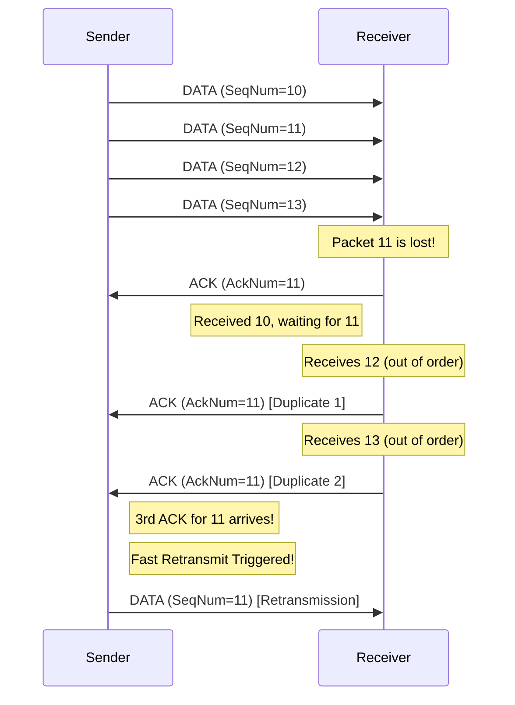

# Chapter 5: Sliding Window & Advanced Flow Control

Our protocol is now robust, but it's not efficient. The Stop-and-Wait method we built in the last chapter suffers from a major performance bottleneck on any network with latency. In this chapter, we will upgrade our protocol to a **Sliding Window** algorithm, the same core concept that makes modern TCP so fast.

---

### 1. Remember & Understand (The "Why")

**The Problem:**
In Stop-and-Wait, the sender's network pipe is almost always empty. It sends one packet and then sits idle, waiting for an ACK to travel all the way back before it can send the next one. We are failing to make use of the available bandwidth.

**The Theory: The Sliding Window**
Instead of one packet, the sender will be allowed to have a "window" of multiple packets in-flight (sent but not yet acknowledged) at the same time.

-   **Window Size (`max_win`):** The maximum number of bytes that can be unacknowledged.
-   **`send_base`:** The sequence number of the oldest packet in the window.
-   **`next_seq_num`:** The sequence number of the next new packet to send.

The sender can send new packets as long as `next_seq_num - send_base < max_win`. When an ACK arrives, it "slides" the `send_base` forward, opening up the window to allow more data to be sent. This keeps the network pipe full and maximizes throughput.

To support this, the receiver must now be able to **buffer** packets that arrive out of order.

---

### 2. Apply (The "How")

**Design Sketch (Workshop on Paper):**

The Fast Retransmit optimization is a key benefit of the sliding window. This diagram shows how it works.



Here is the pseudocode for the advanced protocol logic:

**Sender Logic (Sliding Window):**
```pseudocode
function send_data_sliding_window(file_bytes):
  // Initialize window variables
  send_base = initial_seq_num
  next_seq_num = initial_seq_num
  
  // Data structures for managing the window
  retransmission_buffer = new map() // Stores sent, un-ACKed segments
  dup_ack_count = 0
  
  while send_base < length(file_bytes):
    // 1. Fill the window with new data
    while (next_seq_num - send_base) < MAX_WINDOW_SIZE and next_seq_num < length(file_bytes):
      payload = read_chunk(file_bytes, next_seq_num)
      segment = create_segment(SeqNum=next_seq_num, Payload=payload)
      retransmission_buffer.add(segment)
      send(segment)
      next_seq_num = next_seq_num + length(payload)
      
      // Start the timer only for the first packet in the window
      if not is_timer_running():
        start_timer(RTO)
        
    // 2. Wait for an event (ACK or Timeout)
    event = wait_for_event()
    
    if event is ACK:
      if event.AckNum > send_base:
        // This is a good, cumulative ACK. Slide the window.
        send_base = event.AckNum
        dup_ack_count = 0
        // Remove ACKed segments from the buffer
        retransmission_buffer.remove_all_before(send_base)
        
        // If there are still packets in flight, restart the timer
        if not retransmission_buffer.is_empty():
          restart_timer(RTO)
        else:
          stop_timer()
          
      else:
        // This is a duplicate ACK
        dup_ack_count = dup_ack_count + 1
        if dup_ack_count == 3:
          // Fast Retransmit!
          segment_to_resend = retransmission_buffer.get(send_base)
          send(segment_to_resend)
          restart_timer(RTO)
          
    if event is TIMEOUT:
      // Timeout occurred. Resend the oldest unacknowledged packet.
      segment_to_resend = retransmission_buffer.get(send_base)
      send(segment_to_resend)
      restart_timer(RTO)
```

**Receiver Logic (with Buffering):**
```pseudocode
function handle_established_state_sliding_window(segment):
  if segment.has_flag(DATA):
    // Always validate checksum first (not shown for brevity)
    
    // If the segment is the one we're waiting for
    if segment.SeqNum == expected_seq_num:
      write_to_file(segment.Payload)
      expected_seq_num = expected_seq_num + length(segment.Payload)
      
      // Now, check the buffer for any contiguous segments
      while receive_buffer.has(expected_seq_num):
        buffered_segment = receive_buffer.get(expected_seq_num)
        write_to_file(buffered_segment.Payload)
        expected_seq_num = expected_seq_num + length(buffered_segment.Payload)
        receive_buffer.remove(buffered_segment.SeqNum)
        
    // If the segment is a future packet
    else if segment.SeqNum > expected_seq_num:
      // Buffer it for later
      receive_buffer.add(segment)
      
    // Always send a cumulative ACK for the next in-order byte we need
    ack_segment = create_segment(flags=ACK, AckNum=expected_seq_num)
    send(ack_segment)
```

---

### 3. Analyze (The "Trade-offs")

**Puzzle / Critical Thinking: Fast Retransmit**

Waiting for a timeout to detect a lost packet is slow. The sliding window enables a much faster method.

Imagine the window size is 5, and the sender sends packets 10, 11, 12, 13, 14.
-   Packet 11 is lost.
-   Packets 10, 12, 13, and 14 arrive safely.

The receiver gets packet 10 and sends `ACK=11`. Then it gets packet 12. Since it's still waiting for 11, what ACK does it send? What about when it gets 13 and 14?

What will the sender see? How can it use this stream of ACKs as a clue to retransmit packet 11 *without* waiting for the RTO timer to expire? This is the logic behind **Fast Retransmit**.

---

### 4. Evaluate (The "Justification")

**Design Rationale:**

The sliding window protocol is significantly more complex than Stop-and-Wait, but it provides a massive performance boost. It is the dominant flow control algorithm for virtually all reliable protocols for this reason.

The key design decisions are:
-   **Cumulative ACKs:** This is an elegant and efficient design. A single ACK number provides the sender with a wealth of information, simultaneously acknowledging all prior packets and indicating the next expected one.
-   **Single Retransmission Timer:** Using one timer for the `send_base` is a crucial optimization. It simplifies the sender's logic immensely. If the oldest packet gets acknowledged, the window slides, and the timer is simply reset for the new `send_base`. If it times out, only the oldest packet needs to be resent, and the cumulative ACK mechanism will eventually signal the status of the rest of the window.
-   **Fast Retransmit:** Triggering a retransmission after 3 duplicate ACKs is a standard heuristic. It's a trade-off. Waiting for only 1 or 2 duplicate ACKs might cause spurious retransmissions on a network that just reorders packets slightly. Waiting for 4 or more adds unnecessary delay. Three has been proven in practice to be a good balance.

---

### 5. Create (Your Implementation)

**Coding Workshop:**

This is the final and most complex upgrade to our protocol logic. It requires a significant overhaul of both the Sender and Receiver.

1.  **Update your Sender:**
    *   Implement a **retransmission buffer** (e.g., a dictionary or hash map) to store copies of segments that are in-flight.
    *   Change the main data loop to continuously send new segments as long as the window is not full (`next_seq_num - send_base < max_win`).
    *   Implement a **single timer** for the `send_base`. This timer should be reset whenever the `send_base` advances.
    *   Add logic to handle **duplicate ACKs**. Keep a counter, and when it reaches 3, trigger a **Fast Retransmit** of the segment at `send_base`.
2.  **Update your Receiver:**
    *   Implement a **receive buffer** to store out-of-order segments.
    *   When an in-order segment arrives, write its data to the file. Then, check the buffer for any contiguous segments that can now be written.
    *   When an out-of-order segment arrives, add it to the buffer.
    *   Ensure your ACK logic is always **cumulative**, sending an ACK for the `expected_seq_num`.

Congratulations! You have now implemented a modern, high-performance, reliable transport protocol. The final step is to learn how to test it and verify its performance.

**[Previous Chapter: Robust Transfer](./../04-robust-transfer/README.md)** | **[Next Chapter: Testing and Finalization](./../06-testing-and-finalization/README.md)**