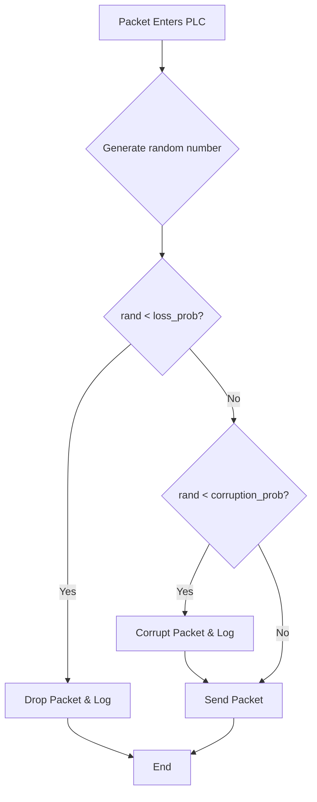

# Chapter 6: Testing and Finalization

Congratulations! You have designed and built a complete, robust, and efficient reliable transport protocol. But how do we prove it works? And how do we measure its performance? This final chapter covers testing your creation under adverse conditions and logging the final results.

---

### 1. Remember & Understand (The "Why")

**The Problem:**
Our protocol is designed for unreliable networks, but our local development network (`localhost`) is almost perfectly reliable. We can't be confident our protocol works until we've seen it handle packet loss and corruption.

**The Theory: The PLC Module (The Gremlin)**
To solve this, we need a **Packet Loss & Corruption (PLC)** simulator. This is a "gremlin" module that sits between our protocol logic and the network socket. It will intentionally drop and corrupt packets based on a probability we set. This allows us to create a controlled, repeatable, and harsh environment to rigorously test our protocol's reliability features.

---

### 2. Apply (The "How")

**Design Sketch (Workshop on Paper):**

The logic for the PLC "gremlin" can be visualized as a simple flowchart for every packet it processes.



Here is the pseudocode for the PLC module:

```pseudocode
class PLC_Module:
  // Initialized with probabilities from command line
  property forward_loss_prob
  property forward_corrupt_prob
  
  function send(packet):
    // 1. Decide whether to drop
    if random_float(0, 1) < forward_loss_prob:
      log("Packet dropped", packet.SeqNum)
      return // Do nothing
      
    // 2. Decide whether to corrupt
    if random_float(0, 1) < forward_corrupt_prob:
      log("Packet corrupted", packet.SeqNum)
      corrupted_packet = corrupt(packet)
      raw_socket_send(corrupted_packet)
      return
      
    // 3. If neither, send normally
    log("Packet sent ok", packet.SeqNum)
    raw_socket_send(packet)

function corrupt(packet):
  // Create a mutable copy of the packet's bytes
  packet_bytes = packet.pack()
  
  // Pick a random byte in the payload to flip
  if length(packet_bytes) > HEADER_LENGTH:
    payload_offset = random_integer(HEADER_LENGTH, length(packet_bytes) - 1)
    
    // Flip a single bit
    packet_bytes[payload_offset] = packet_bytes[payload_offset] XOR 1
    
  return packet_bytes
```

And for the final statistics, you would add a method to your logger.

**Logger Module:**
```pseudocode
class Logger:
  // ... existing logging methods
  
  function log_final_stats(stats_dictionary):
    write_to_file("\n--- FINAL STATS ---")
    for key, value in stats_dictionary:
      write_to_file(key + ": " + value)
    write_to_file("-------------------")
```

---

### 3. Analyze (The "Trade-offs")

**Puzzle / Critical Thinking:**

You are testing your protocol with the PLC set to a 10% forward loss probability (`flp=0.1`). You notice that your file transfer is successful, but it's slower than you expect. Your logs show many `timeout` events, but very few `dup_ack` or `fast_retransmit` events.

What does this tell you about the *pattern* of packet loss? Is the PLC dropping single, isolated packets, or is it likely dropping several packets in a row? Why would the latter scenario prevent Fast Retransmit from working effectively?

---

### 4. Evaluate (The "Justification")

**Design Rationale:**

Our PLC module uses a simple, uniform random probability for dropping packets. As you may have inferred from the puzzle, this doesn't perfectly simulate real-world internet packet loss, which often occurs in "bursts" (where multiple consecutive packets are lost) due to network congestion.

A burst loss will defeat the Fast Retransmit mechanism, as not enough subsequent packets will arrive to generate the required duplicate ACKs. In this scenario, the protocol must fall back to the slower, but more robust, RTO timer.

For our project, a uniform random PLC is a good and simple model. It allows us to test both Fast Retransmit (when single packets are dropped) and RTO recovery (when bursts are simulated by chance). Building a more complex, burst-aware PLC model would be an interesting extension, but is not necessary for validating the core logic of our protocol.

---

### 5. Create (Your Implementation)

**Coding Workshop:**

It's time to build your testing tools and finalize the project.

1.  **Build the PLC Module.** Create a module that can be placed between your protocol logic and the raw socket.
    *   It should have methods like `send()` that take a packet.
    *   Inside, it should use a random number generator to decide whether to drop the packet, corrupt it, or send it normally, based on the probabilities provided.
    *   Remember to handle both the forward (data) and reverse (ACK) paths.
2.  **Integrate the PLC.** Modify your Sender and Receiver to use the PLC module for all outgoing network calls. All command-line arguments for loss/corruption probabilities should be passed to this module.
3.  **Add Statistics Logging.**
    *   Create a `Logger` module if you haven't already. It should handle writing formatted strings to your log files.
    *   Add counters to your Sender and Receiver logic to track key metrics (e.g., total data segments sent, retransmissions, duplicate ACKs received, etc.).
    *   Add a final method to your logger to write a summary of these statistics at the end of the transfer.

You have now completed the entire project. You have a fully functional, reliable, and, most importantly, *testable* transport protocol.

**[Previous Chapter: Sliding Window](./../05-sliding-window/README.md)**
